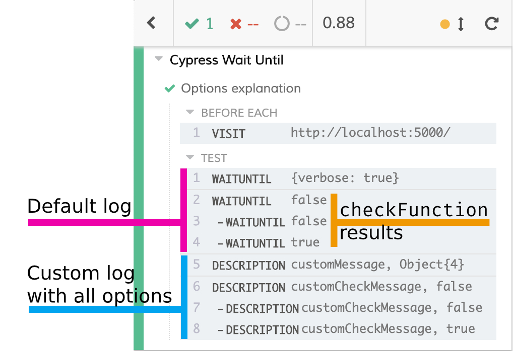

# cypress-wait-until

Add the Cypress waiting power to virtually everything 🎉

[](https://travis-ci.com/NoriSte/cypress-wait-until)
[](https://travis-ci.com/NoriSte/cypress-wait-until)
[](https://renovatebot.com/)
[](https://dashboard.cypress.io/#/projects/g21npg/runs)
[](https://www.npmjs.com/package/cypress-wait-until)
<br />
[](http://commitizen.github.io/cz-cli/)
[](https://app.fossa.io/projects/git%2Bgithub.com%2FNoriSte%2Fcypress-wait-until?ref=badge_shield) [](https://github.com/semantic-release/semantic-release) [](https://opensource.org/licenses/MIT)
[](https://github.com/ellerbrock/typescript-badges/)
[](https://www.meetup.com/it-IT/Open-Source-Saturday-Milano/)

Use this plugin to wait for everything not expected by [Cypress wait](https://docs.cypress.io/api/commands/wait.html#Syntax).

## Installation

```bash
npm i -D cypress-wait-until
# or
yarn add -D cypress-wait-until
```

## Usage

`cypress-wait-until` extends Cypress' `cy` command.

Add this line to your project's `cypress/support/commands.js`:

```javascript
import 'cypress-wait-until';
```

Then, in your test, you can write

```javascript
// wait until a cookie is set
cy.waitUntil(() => cy.getCookie('token').then(cookie => Boolean(cookie && cookie.value)));

// wait until a global variable has an expected value
cy.waitUntil(() => cy.window().then(win => win.foo === "bar"));

// sync function works too!
cy.waitUntil(() => true);

// with all the available options
cy.waitUntil(() => cy.window().then(win => win.foo === "bar"), {
  errorMsg: 'This is a custom error message', // overrides the default error message
  timeout: 2000, // waits up to 2000 ms, default to 5000
  interval: 500 // performs the check every 500 ms, default to 200
});
```

If you return a truthy value, it becomes the subject for the next command. So you can assert about
it too

```javascript
// wait until the Recaptcha token will be added to the dedicated hidden input field...
cy.waitUntil(() => cy.get("input[type=hidden]#recaptchatoken").then($el => $el.val()))
  // ... then, check that it's valid string asserting about it
  .then(token => expect(token).to.be.a("string").to.have.length.within(1, 1000));
```

The `waitUntil` command could be chained to other commands too. As an example, the following codes are equivalent
```javascript
cy.waitUntil(() => cy.getCookie('token').then(cookie => cookie.value === '<EXPECTED_VALUE>'));
// is equivalent to
cy.wrap('<EXPECTED_VALUE>')
  .waitUntil((subject) => cy.getCookie('token').then(cookie => cookie.value === subject));
```
**Please note**
- do not expect that the previous command is retried. Only what's inside the `checkFunction` body is retried
```javascript
cy.getCookie('token') // will not be retried
  .waitUntil(cookie => cookie.value === '<EXPECTED_VALUE>');
```
- you cannot put assertions inside `checkFunction`. There is no way to avoid a test failure [if an assertion throws an error](https://stackoverflow.com/questions/56743695/error-handling-using-the-catch-block-in-cypress). You must manually check what the assertions would check for you. The most common case is checking that an element exists or not, instead of using `cy.get('#id').should('exist')` you should check that `Cypress.$('#id').length` is greater than `0`. [Here](https://github.com/NoriSte/cypress-wait-until/issues/75#issuecomment-572685623) you can find a deeper explanation

- nested `cy.waitUntil` calls don't respect `timeout` options. `timeout` and `interval` are converted to a number of retries. If the parent `cy.waitUntil` retries 10 times and the nested one 15 times, then the latter will be run 150 times before giving up, resulting in an extremely long wait. See [the discussion](https://github.com/NoriSte/cypress-wait-until/issues/241) for more info


### TypeScript

If you use TypeScript you can define the `checkFunction` returning type too. Take a look at the [plugin.spec.ts](./cypress/types/plugin.spec.ts) file to read about the `cy.waitUntil` signature.

#### IMPORTANT:
1. Remember to add `cypress-wait-until` to the `cypress/tsconfig.json` file

```javascript
{
  "compilerOptions": {
    "types": ["cypress", "cypress-wait-until"]
  }
}
```

2. If you are encountering "cy.waitUntil is not a function" or "cy.waitUntil is undefined", you might need to specify the support file in your `cypress.json` for the import to work correctly:

```javascript
{
  "supportFile": "cypress/support/commands.ts"
}

```


## Arguments

- checkFunction

A function that must return a truthy value when the wait is over.

- options:Object (optional)

Pass in an options object to change the default behavior of `cy.waitUntil()`.

| Option               | Type                   | Default                | Description                                                                                                                                               |
| -------------------- | ---------------------- | ---------------------- | --------------------------------------------------------------------------------------------------------------------------------------------------------- |
| `errorMsg`           | `string` \| `function` | `"Timed out retrying"` | The error message to write. If it's a function, it will receive the last result and the options passed to `cy.waitUntil`                                  |
| `timeout`            | `number`               | `5000`                 | Time to wait for the `checkFunction` to return a truthy value before throwing an error.                                                                   |
| `interval`           | `number`               | `200`                  | Time to wait between the `checkFunction` invocations.                                                                                                     |
| `description`        | `string`               | `"waitUntil"`          | The name logged into the Cypress Test Runner.                                                                                                             |
| `logger`             | `function`             | `Cypress.log`          | A custom logger in place of the default [Cypress.log](https://docs.cypress.io/api/cypress-api/cypress-log.html). It's useful just for debugging purposes. |
| `log`                | `boolean`              | `true`                 | Enable/disable logging.                                                                                                                                   |
| `customMessage`      | `string`               | `undefined`            | String logged after the `options.description`.                                                                                                            |
| `verbose`            | `boolean`              | `false`                | If every single check result must be logged.                                                                                                              |
| `customCheckMessage` | `string`               | `undefined`            | Like `customMessage`, but used for every single check. Useless if `verbose` is not set to `true`.                                                         |

Log options are a lot, take a look at the next screenshot to understand how they are printed



<br />
<br />

## Could cy.waitUntil avoid failing the test?

No. `cy.waitUntil` waits for something that must happen, otherwise the test will fail. [Cypress enforces to avoid conditional testing](https://docs.cypress.io/guides/core-concepts/conditional-testing.html) and the plugin agrees with that.

There are cases where conditional testing makes sense but if `cy.waitUntil` would have this capability everyone will use it to create conditional tests, treating the Cypress feature—because avoiding conditional testing is a feature—as "a bug".

If you need conditional testing you could write your own recursive promise check function (take a look [here](https://stackoverflow.com/questions/54883861/how-can-i-wait-for-each-element-in-a-list-to-update-to-a-certain-text-using-cypr/55363629#55363629) and [here](https://stackoverflow.com/questions/54732818/how-do-i-wait-until-a-cookie-is-set/54743229#54743229) where it is explained how to do that) where you manage your case. After all, `cy.waitUntil` is just a recursive promise manager 😊

## Why did we write it?

A lot of StackOverflow users had some difficulties in implementing a recursive promise with Cypress
just to repeatedly check for something to happen (see two of the various questions about the topic: [How can i wait for each element in a list to update to a certain
text?](https://stackoverflow.com/questions/54883861/how-can-i-wait-for-each-element-in-a-list-to-update-to-a-certain-text-using-cypr/55363629#55363629)
And [How do I wait until a cookie is
set?](https://stackoverflow.com/questions/54732818/how-do-i-wait-until-a-cookie-is-set/54743229#54743229)).
<br />
This plugin is dedicated to them ❤️


## Open Source Saturday

This project has been made during one of the Open Source Saturdays, a series of Milan-based events
where everyone codes just to spread some Open Source love ❤️

## Contributing

Contributes are welcome, if you need to run the tests through `npm test`, you must update the package.json configuration setting `cypressUploadRecordings` to `false` (or set your own [Cypress recording key](https://docs.cypress.io/guides/guides/command-line.html#Options)).

## Contributors

Thanks goes to these wonderful people ([emoji key](https://allcontributors.org/docs/en/emoji-key)):

<!-- ALL-CONTRIBUTORS-LIST:START - Do not remove or modify this section -->
<!-- prettier-ignore-start -->
<!-- markdownlint-disable -->
<table>
  <tr>
    <td align="center"><a href="https://twitter.com/NoriSte"><br /><sub><b>Stefano Magni</b></sub></a><br /><a href="https://github.com/NoriSte/cypress-wait-until/commits?author=NoriSte" title="Code">💻</a> <a href="https://github.com/NoriSte/cypress-wait-until/commits?author=NoriSte" title="Tests">⚠️</a> <a href="https://github.com/NoriSte/cypress-wait-until/commits?author=NoriSte" title="Documentation">📖</a></td>
    <td align="center"><a href="https://github.com/allevo"><br /><sub><b>Tommaso Allevi</b></sub></a><br /><a href="https://github.com/NoriSte/cypress-wait-until/commits?author=allevo" title="Code">💻</a> <a href="https://github.com/NoriSte/cypress-wait-until/commits?author=allevo" title="Tests">⚠️</a></td>
    <td align="center"><a href="https://github.com/brogueady"><br /><sub><b>brogueady</b></sub></a><br /><a href="https://github.com/NoriSte/cypress-wait-until/commits?author=brogueady" title="Code">💻</a></td>
    <td align="center"><a href="https://github.com/seeu1"><br /><sub><b>seeu1</b></sub></a><br /><a href="#ideas-seeu1" title="Ideas, Planning, & Feedback">🤔</a></td>
    <td align="center"><a href="https://github.com/sweir27"><br /><sub><b>Sarah Weir</b></sub></a><br /><a href="https://github.com/NoriSte/cypress-wait-until/issues?q=author%3Asweir27" title="Bug reports">🐛</a> <a href="https://github.com/NoriSte/cypress-wait-until/commits?author=sweir27" title="Code">💻</a></td>
    <td align="center"><a href="https://github.com/john20xdoe"><br /><sub><b>Lee Alexis</b></sub></a><br /><a href="https://github.com/NoriSte/cypress-wait-until/commits?author=john20xdoe" title="Documentation">📖</a></td>
    <td align="center"><a href="https://github.com/peburrows"><br /><sub><b>Phil Burrows</b></sub></a><br /><a href="#ideas-peburrows" title="Ideas, Planning, & Feedback">🤔</a> <a href="https://github.com/NoriSte/cypress-wait-until/commits?author=peburrows" title="Code">💻</a> <a href="https://github.com/NoriSte/cypress-wait-until/commits?author=peburrows" title="Tests">⚠️</a></td>
  </tr>
  <tr>
    <td align="center"><a href="https://github.com/LeoVie"><br /><sub><b>Leo Viezens</b></sub></a><br /><a href="https://github.com/NoriSte/cypress-wait-until/commits?author=LeoVie" title="Documentation">📖</a></td>
    <td align="center"><a href="https://pierluc.io/"><br /><sub><b>Pier-Luc Gendreau</b></sub></a><br /><a href="https://github.com/NoriSte/cypress-wait-until/commits?author=Zertz" title="Documentation">📖</a></td>
  </tr>
</table>

<!-- markdownlint-restore -->
<!-- prettier-ignore-end -->

<!-- ALL-CONTRIBUTORS-LIST:END -->

This project follows the [all-contributors](https://github.com/all-contributors/all-contributors) specification. Contributions of any kind welcome!
